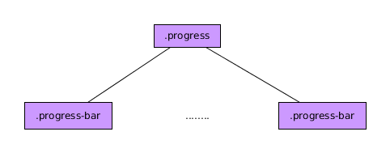

# Componente Progreso

El componente Progreso es el componente BootStrap 4 para crear barras de progreso. La estructura general que deberemos seguir para utilizar dichos componentes es la siguiente:

En cada una de estos elementos ***.progress-bar*** podremos hacer cosas como:

* Establecer el color de los mismos usando las clases de BootStrap ***bg-X*** siendo X uno de los colores de la paleta de BootStrap 4.
* Establecer la altura de los mismos jugando con el atributo CSS ***height*** del elemento padre ( ***.progress*** )
* Establecer el porcentaje de progreso jugando con el atributo CSS ***widht*** de los posibles elementos ***.progress-bar***.
* Hacer que tenga estilo rallado añadiendo la clase BootStrap 4 ***progress-bar-striped***  a los elementos con las clase ***progress-bar***.
* Repartir todo el ancho de un mismo ***progress*** entre varios ***progress-bar***.
* Hacer que los elementos tengan una animación añadiendo la clase ***progress-bar-animated*** a los elementos ***progress-bar***.
* Añadir contenido al elemento ***progress-bar*** . Normalmente para describir el avance del mismo.

No hay funciones y eventos asociados a este componente.
