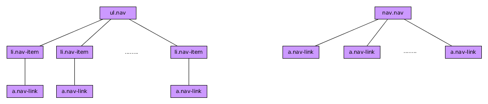

# Componente Nav

El componente BootStrap 4 ***Nav*** es el componente básico de BootStrap 4 para formar menús y barras de navegación. Posteriormente veremos que existe otro componente que nos va a permitir realizar barras de navegación más complejas, el componente ***NavBar***.

Este componente tiene bastantes posibilidades pero, en su estructura más sencilla, podemos optar por una jerarquía formada a partir de listas HTML o bien por una jerarquía formada a partir de la etiqueta semántica nav. Personalmente recomiendo la segunda, es más corta y aporta significado. En todo caso podemos ver esas jerarquías aquí:




Podemos ver un ejemplo con cada una de estas posibilidades aquí:

```html

    <!-- Menú de navegación con listas -->
    <ul class="nav">
      <li class="nav-item"><a href="#" class="nav-link">Inicio</a></li>
      <li class="nav-item"><a href="#" class="nav-link">Novedades</a></li>
      <li class="nav-item"><a href="#" class="nav-link">Nosotros</a></li>
      <li class="nav-item"><a href="#" class="nav-link">Contacto</a></li>  
    </ul>

    <!-- Menú de navegación con elementos semánticos -->
    <nav class="nav">
      <a href="#" class="nav-link">Inicio</a>
      <a href="#" class="nav-link">Novedades</a>
      <a href="#" class="nav-link">Nosotros</a>
      <a href="#" class="nav-link">Contacto</a>
    </nav>

```
Para alinear los elementos del menú podemos usar las [utilidades flex de BootStrap 4](https://getbootstrap.com/docs/4.0/utilities/flex/).

Además de la forma tradicional de menú podemos optar por un menú de pestañas (***tabs***) o un menú de píldoras (***pills***). Para ello nos basta con añadir las clases ***nav-tabs*** o ***nav-pills*** al elemento que padres, el que posee la clase ***nav***.

En estos dos casos para ver que lo estamos aplicando correctamente debemos añadir la clase ***active*** a alguno de los elementos del menú.

### Consideraciones adicionales.

* Para que el menú ocupe toas la anchura del padre,si hemos construido el menú con listas debemos añadir la clase ***nav-fill*** al elemento padre que contiene la clase ***nav*** y adicionalmente, añadir la clase ***nav-item*** a los enlaces si hemos usado la etiqueta *nav*.
* Si queremos que todos los elementos del menú ocupen lo mismo en anchura debemos añadir la clase ***nav-justified*** al elemento padre y adicionalmente, añadir la clase ***nav-item*** a los enlaces si hemos usado la etiqueta *nav*.
* Podemos construir menús anidados usando el componente ***dropbdown*** que hemos visto anteriormente siendo el elemento padre del ***dropdown*** el que contiene la clase ***nav-item***.


### Construcción de un menú dinámico de pestañas/píldoras con contenidos

Usando este componente podemos crear paneles de contenidos animados de tal manera que, dependiendo de en cuál de las opciones del menú hagamos click, se nos mostrará una panel de contenidos u otro.

**IMPORTANTE:** En este caso no podemos meter componentes ***dropdown*** dentro del menú.

Para todo esto necesitaremos añadir ciertos atributos a nuestros elementos. Lo mejor será verlo con un ejemplo de *nav* usando la etiqueta nav (con lista es similar).


```html

  <!-- ELEMENTO DE NAVEGACIÓN -->
  <nav class="nav nav-tabs">
    <a href="#inicio" class="nav-link active" data-toggle="tab">Inicio</a>
    <a href="#novedades" class="nav-link" data-toggle="tab">Novedades</a>
    <a href="#nosotros" class="nav-link" data-toggle="tab">Nosotros</a>
    <a href="#contacto" class="nav-link" data-toggle="tab">Contacto</a>
  </nav>

  <!-- PANELES DE CONTENIDOS -->
  <div class="tab-content">
    <div class="tab-pane fade show active" id="inicio">Contenido del Panel Inicio</div>
    <div class="tab-pane fade" id="novedades">Contenido del Panel Novedades</div>
    <div class="tab-pane fade" id="nosotros">Contenido del Panel Nosotros</div>
    <div class="tab-pane fade" id="contacto">Contenido del Panel Contacto</div>
  </div>

```

Debiendo:

* Añadir a los elementos del menú el atributo ***data-toggle="tab"*** o ***data-toggle="pill"***
* Añadiendo a los elementos del menú el ***href*** correcto indicando el id del elemento en cuestión que quiero mostrar (podríamos usar ***data-target*** también)
* Creando la jerarquía ***tab-content***, ***tab-pane*** con los ids correctos.
* Indicando cuál es el seleccionado inicialmente mediante las clases ***active*** y ***show*** y añadiendo la clase ***fade*** si queremos un efecto de desvanecimiento.

## Funciones asociadas


* ***.tab()*** Activa una pestaña. Debe tener el atributo ***data-target*** o el ***href*** correcto.
* ***.tab('show')*** Dada una pestaña muestra el panel asociado.
* ***.tab('dispose')*** Destruye el componente.Deja de funcionar como tal.


## Eventos asociados

La interacción con este tipo de elementos genera 4 nuevos tipos de eventos, bastante auto explicativos por su nombre y de los cuáles, para saber más detalles deberemos visitar el manual de referencia.

* ***hide.bs.tab***
* ***show.bs.tab***
* ***hidden.bs.tab***
* ***shown.bs.tab***
