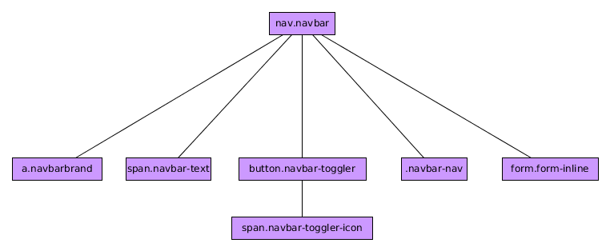

# Componente NavBar

El componente BootStrap 4 ***Navbar*** es un componente que nos permite construir barras de navegación responsivas y más complejas que las que podemos construir con el componente *Nav*

Puede estar formado (no todos son obligatorios) por lo siguiente elementos:

* Un  elemento ***navbar-brand*** para mostrar el logo, nombre de tu empresa, web etc...
* Un elemento menú ***navbar-nav*** que es similar al componente *nav* que hemos visto anteriormente.
* Un formulario que forme parte del menú de navegación y que se mostrará en línea (***form-inline***)
* Textos que queramos incluir en el propio menú mediante un  elemento en línea ***navbar-text***.
* Un elemento ***navbar-toggler*** que se usará con el componente ***collapse*** para mostrar el menú cuando se haya ocultado porque ya no cabe en pantalla por su comportamiento responsivo.


De manera general podemos decir que tienen la siguiente estructura:



Un ejemplo sería el siguiente:


```html

    <nav class="navbar navbar-expand-sm navbar-dark bg-dark">
      <a class="navbar-brand" href="#"></a>
      <button class="navbar-toggler" type="button" data-toggle="collapse" data-target="#menu">
        <span class="navbar-toggler-icon"></span>
      </button>
      <span class="navbar-text text-white">
        Asegura tu futuro con nosotros
      </span>
      <div class="collapse navbar-collapse" id="menu">
        <nav class="navbar-nav">
            <a class="nav-link" href="#">Inicio</a>
            <a class="nav-link active" href="#">Novedades</a>
            <a class="nav-link" href="#">Nosotros</a>
            <a class="nav-link" href="#">Contacto</a>
        </nav>
      </div>
      <form class="form-inline">
        <input class="form-control form-control-sm mr-md-2" type="search" placeholder="Buscar">
        <input class="btn btn-primary btn-sm" type="submit">
      </form>
    </nav>

```

**IMPORTANTE:** Si queremos que el menú se muestre desplegado desde el principio no debemos olvidarnos de la clase ***nav-expand-X*** siendo X uno de los breakpoints de BootStrap (sm,md,lg,xl). A partir de ese breakpoint se mostrará sin colapsar.Para más detalles ver el curso de maquetación.

Podemos cambiar los colores del menú usando las clases ***navbar-X*** y ***bg-X*** siendo X un color de la paleta de colores de BootStrap 4.

### Posicionando el menú

Si queremos posicionar el menú de manera fija (no posiciones *static*) podemos usar las clases ***fixed-top***, ***fixed-bottom*** y ***sticky-top*** (aún no soportado por todos los navegadores).

### NavBar Responsive.

El ejemplo sugerido ya era una barra de menú responsiva. Para conseguir eso debemos hacer lo siguiente:

* En primer luego decidir a partir de qué tamaño el menú se va a mostrar entero. Para ello usaremos las clases ***navbar-expand-X*** tal y como hemos explicado anteriormente.
* Tener un elemento con las clase ***navbar-toggler*** y los atributos ***data-toggle="collapse"*** y ***data-target="#MenuID"*** donde el menú ***navbar-nav*** estará dentro de un elemento con las clases ***collapse navbar-collapse*** y el id indicado en el ***data-target***.

No hay funciones y eventos asociados a este componente.
