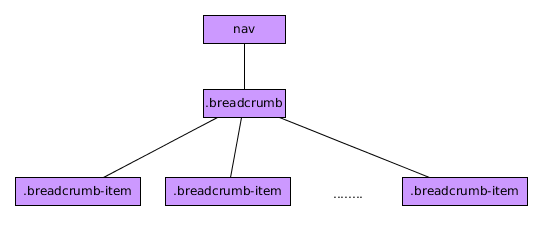

# Componente BreadCrumbs

El componente BootStrap 4 *BreadCrumbs* (miguitas de pan en castellano) es un componente sencillo de BootStrap  4 que nos permite mostrar en qué lugar de la jerarquía de los contenidos de nuestra página nos encontramos.

Tiene, de manera general. la siguiente jerarquía:



Un ejemplo sencillo de su uso sería el siguiente:

```html

  <nav>
    <div class="breadcrumb">
        <div class="breadcrumb-item"><a href="#">Inicio</a></div>
        <div class="breadcrumb-item"><a href="#">Noticias</a></div>
        <div class="breadcrumb-item active">Últimas noticias</div>
    </div>
  </nav>

```
Siendo:

* ***breadcrumb*** el elemento general que debería dentro de una etiqueta *nav* ya que es un elemento de navegación.
* ***breadcrumb-item*** cada uno de los niveles de la jerarquía debiendo ser el último el que tenga, adicionalmente, la clase ***active***.

Este componente no posee funciones asociadas ni dispara eventos.
