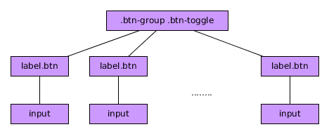
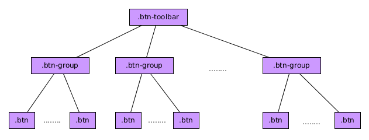

# Componentes Button

El componente BootStrap 4 ***Button*** nos sirve para representar botones. Esto se consigue añadiendo la clase ***btn*** a las etiquetas ***button***,***a*** e ***input***. 

No vamos a representar la jerarquía del DOM por ser sólo un elemento.

Por ejemplo:

```html

  <button class="btn" value="Botón">

```

### Modificaciones de los botones

* Si queremos añadir colores podemos usar las clases ***bnt-X*** siendo X uno de los colores de la paleta de Bootstrap.
* Si quiero que los colores sean sólo para el borde y texto pero que no tenga fondo usaré la clase ***btn-outline-X*** siendo X uno de los colores de la paleta de BooStrap.
* Si quiero modificar el tamaño puedo añadir las clases ***btn-lg*** (grandes), ***btn-sm*** (pequeños) o hacer que los botones se comporten como elementos de bloque ocupando todo el ancho del padre ***btn-block***.


# Checkboxes y Radios usando botones.

Usando BootStrap 4 podemos modificar la apariencia de los elementos *radio* y *checkbox* para que se muestren como si fueran botones.

Para simular con botones un radio group podemos utilizar una estructura similar a la siguiente:



Un ejemplo sería el siguiente:


```html
  <div class="btn-group btn-group-toggle" data-toggle="buttons">
    <label class="btn btn-primary">
      <input type="radio" name="options" id="opA" > Opción A
    </label>
    <label class="btn btn-primary active">
      <input type="radio" name="options" id="opB" checked> Opción B
    </label>
    <label class="btn btn-primary">
      <input type="radio" name="options" id="opC"> Opción C
    </label>
  </div>
```
Fijaros que en este caso:

* Hemos añadido al padre de la estructura las clases ***btn-group*** y ***btn-group-toggle*** y el atributo ***data-toggle="buttons"***.
* Hemos convertido, en este caso, las etiquetas en botones con las clase ***btn***.

En caso de que quisieramos hacer lo mismo con un *checkbox* sólo tenemos que cambiar el atributo *type* del input.

### Funciones asociadas.

* ***.button('toogle')*** Simula que el el botón esté seleccionado o no (activado)
* ***.button('dispose')*** Destruye el elemento botón, deja de funcionar como tal.


# Componente Button Group

El componente BootStrap 4 ***Button Group*** sirve para agrupar botones en una sola linea pudiendo tener más de una agrupación para formar una barra de botones o botonera.

De manera general la estructura del DOM sería similar a la siguiente:




Podemos verlo en el siguiente ejemplo:

```html

    <div class="btn-toolbar">
      <div class="btn-group">
        <button type="button" class="btn btn-primary">G1B1</button>
        <button type="button" class="btn btn-primary">G1B2</button>
        <button type="button" class="btn btn-primary">G1B3</button>
      </div>
      <div class="btn-group">
        <button type="button" class="btn btn-warning">G21B1</button>
        <button type="button" class="btn btn-warning">G2B2</button>
        <button type="button" class="btn btn-warning">G2B3</button>
      </div>
      <div class="btn-group">
        <button type="button" class="btn btn-danger">G3B1</button>
        <button type="button" class="btn btn-danger">G3B2</button>
        <button type="button" class="btn btn-danger">G3B3</button>
      </div>
    </div>

```

* Hemos añadido al elemento padre de la botones la clase ***btn-toolbar***.
* Hemos añadido cada grupo de botones dentro de un elemento con la clase ***btn-group***.


Puedo modificar el tamaño del grupo añadiendo la clase ***btn-group-lg*** (grande) o ***btn-group-sm*** (pequeño) al elemento con la clase ***btn-group***.

Si quiero tener *dropdown* (desplegables) tengo que anidar elementos ***btn-group***.

Si quiero que los botones aparezcan en vertical sólo tengo que añadir la clase ***btn-group-vertical*** al elemento con las clase ***btn-group***.


Estos componentes no tienen funciones asociadas ni disparan eventos.
