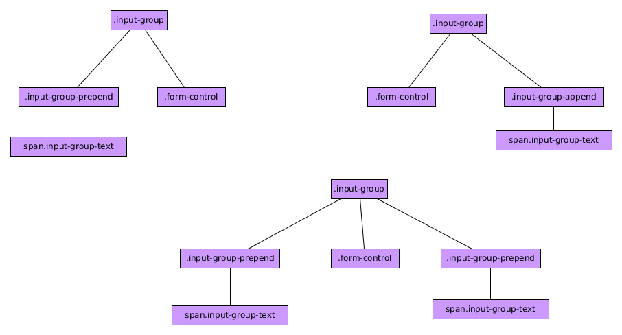

# Componente Input-Group

El componente BootStrap 4 ***Input-Group*** es un componente que nos va servir para extender los controles de los formularios pudiendo añadir *add-ons* como texto, botones o grupos de botones a ambos lados de los campos del mismo.

Presenta varias posibilidades que comentaremos luego pero podemos generalizar varias estructuras:




**IMPORTANTE:** Sólo podemos tener un ***form-control*** en cada ***input-group*** y en caso de querer etiqueta debe estar fuera del ***input-group***. Aunque visualmente puede haber varios, sólo se validará uno.

Podemos ver un ejemplo:

```html
  <label>Tú página Web personal</label>
  <div class="input-group">
    <div class="input-group-prepend">
      <span class="input-group-text">http://www.mysite.edu/</span>
    </div>
    <input type="text" class="form-control" placeholder="Tu nombre de usuario">
    <div class="input-group-append">
      <span class="input-group-text">/site</span>
    </div>
  </div>
```

Puedo modificar el tamaño de los input-group añadiendo las clases ***input-group-lg*** (grande) o ***input-group-sm*** (pequeño).

En vez de únicamente sólo texto, en el elemento con la clase ***input-group-text*** puedo añadir etiquetas input con el tipo *checkbox* o *radio*. Un ejemplo de esto:

```html

  <label>Input con Radio</label>
  <div class="input-group">
    <div class="input-group-prepend">
      <div class="input-group-text">
        <input type="radio" />
      </div>
    </div>
    <input type="text" class="form-control" placeholder="Campo de texto asociado al radio">    
  </div>

```

### Más consideraciones sobre esos add-ons.

* Puedo tener varios elementos con la clase ***input-group-text*** detro de los elementos con las clases ***input-group-prepend*** y ***input-group-append***.
* Puedo añadir botones y *dropdowns* dentro de elementos con las clases ***input-group-prepend*** y ***input-group-append***.


Este componente no tiene funciones asociadas ni dispara eventos.
