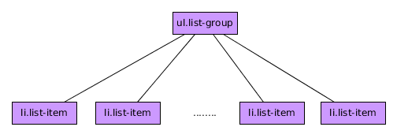

# Componente List Group

El componente BootStrap 4 es un componente que nos va a permitir mostrar una serie de contenidos.

En su ejemplo más básico la jerarquía que debe presentar este componente es la siguiente:

.

Un ejemplo de esta estructura sería:

```html

<ul class="list-group">
  <li class="list-group-item">Opción 1</li>
  <li class="list-group-item">Opción 2</li>
  <li class="list-group-item">Opción 3</li>
  <li class="list-group-item">Opción 4</li>
</ul>

```

Usando las clases ***active*** y ***disabled*** puedo indicar qué elemento se destaca como activo o se muestra como deshabilitado.

Si quiero evitar los bordes y las esquinas redondeadeas tengo que añadir la clase ***list-group-flush*** al elemento principal.

No debo usar las clases ***btn*** y ***btn-X*** en este componente pero si quiero usar la paletas de colores como fondo de los elementos ***list-group-item*** debeo añadir a estos elementos alguna de las clases ***list-group-item-X*** siendo X uno de los colores de la paleta de colores de BootStrap 4.

**IMPORTANTE:** Dentro de estos elementos ***list-group-item*** puedo añadir casi cualquier elemento HTML.

## List-Group con efecto hover.

Si queremos conseguir el efecto hover tendremos que cambiar la estructura dejando de usar listas,usando etiquetas como ***a*** o ***buttom*** como elementos ***list-group-item*** y adicionalmente agregando a esos elementos la clase ***list-group-item-action***.

Un ejemplo de esto sería:

```html

  <div class="list-group">
    <a href="#" class="list-group-item list-group-item-action active">Enlace 1</a>
    <a href="#" class="list-group-item list-group-item-action">Enlace 2</a>
    <a href="#" class="list-group-item list-group-item-action disabled">Enlace 3</a>
    <a href="#" class="list-group-item list-group-item-action">Enlace 4</a>
  </div>

```


## Simulando paneles con el componente list-group

Usando el componente list-group y el código javascript que viene con BootStrap 4 podemos simular paneles de contenidos.

Un ejemplo sería:

```html

  <div class="list-group">
    <a class="list-group-item list-group-item-action active" data-toggle="list" href="#panel1">Panel 1</a>
    <a class="list-group-item list-group-item-action" data-toggle="list" href="#panel2">Panel 2</a>
    <a class="list-group-item list-group-item-action" data-toggle="list" href="#panel3">Panel 3</a>
    <a class="list-group-item list-group-item-action" data-toggle="list" href="#panel4">Panel 4</a>
  </div>

  <div class="tab-content">
    <div class="tab-pane fade show active" id="panel1"><h1>Contenido Panel 1</h1></div>
    <div class="tab-pane fade" id="panel2" ><h1>Contenido Panel 2</h1></div>
    <div class="tab-pane fade" id="panel3" ><h1>Contenido Panel 3</h1></div>
    <div class="tab-pane fade" id="panel4" ><h1>Contenido Panel 4</h1></div>
  </div>

```

Como se puede apreciar para conseguir esto:

* Se ha añadido al elemento con la clase ***list-item-group*** el atributo ***data-toggle="list"*** y se ha establecido el ***href*** al id del panel que queremos mostrar (se puede hacer también con data-target).
* Los paneles se han puesto dentro del elemento con las clase ***tab-content*** y cada uno de los paneles tiene la clase ***tab-pane***.
* La clase ***fade*** es para conseguir un efecto de desvanecimiento al usarla.


### Funciones asociadas.

* ***.tab()***  Activa el funcionamiento de los paneles.
* ***.tab('show')*** Muestra el panel asociado al elemento (por id o data-target).
* ***.tab('hide')*** Oculta el panel asociado al elemento (por id o data-target).

## Eventos asociados

La interacción con este tipo de elementos genera 4 nuevos tipos de eventos. Su nombre es auto-explicativo y para más detalles deberíamos consultar el manual.

* ***hide.bs.tab***
* ***show.bs.tab***
* ***shown.bs.tab***
* ***hidden.bs.tab***
