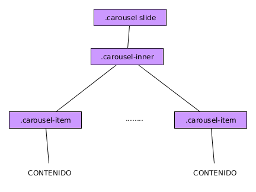

# Componente carousel

El componente BootStrap 4 ***carousel*** es un componente que hemos visto en muchas páginas web y que se encarga de ir mostrándonos diversos contenidos uno tras otro y efectuando un efecto cuando se produce este cambio. Normalmente suelen ser galerías de imágenes.

BootStrap 4 nos proporciona una manera fácil de conseguir este tipo de estructuras y, en su configuración más sencilla necesitaremos una jerarquía similar a la siguiente:


.

Siendo:

* El elemento padre de todo el que tiene las clases ***carousel*** y ***slide*** teniendo además que tener establecido el atributo ***data-ride=carousel***. Si no tenemos la clase ***slide*** no habrá un efecto de deslizamiento.
* ***carousel-inner*** es la clase del elemento que contiene la distintos elementos que mostrará el carrusel.
* ***carousel-item*** es la clase que debe tener cada uno de los elementos que mostrará el carrusel. Lo que pongamos dentro de cada uno de ellos depende de nosotros.

Un ejemplo de esto sería:

```html

  <div class="carousel slide" data-ride="carousel">
    <div class="carousel-inner">
        <div class="carousel-item active">
          
        </div>
        <div class="carousel-item">
          
        </div>
        <div class="carousel-item">
          
        </div>
    </div>
  </div>

```


**IMPORTANTE**: Un error muy común es no elegir uno de los elementos como ***active***. Si no lo hacemos el carrusel no funcionará.

**IMPORTANTE**: El componente no se encarga de dimensionar los contenidos. Debemos hacerlo nosotros usando los estilos necesarios o las utilidades BootStrap 4 que consideremos.

Adicionalmente, a esta estructura por defecto podemos añadirle varias cosas:

* Controles para navegar por la galería a izquierda y a derecha.
* Indicadores que nos señalan en qué posición nos encontramos dentro de la galería.
* Leyendas o *captions* para cada uno de los elementos de la galería.


## Añadir controles al *Carousel*

Si queremos añadir controles a nuestro *carousel* debemos añadir como hijos del elemento con la clase ***carousel***, y después del elemento con la clase ***carousel-inner*** los siguientes elementos:

```html

  <a class="carousel-control-prev" href="#MyCarouselId" data-slide="prev">
    <span class="carousel-control-prev-icon" aria-hidden="true"></span>
    <span class="sr-only">Anterior</span>
  </a>
  <a class="carousel-control-next" href="#MyCarouselId" data-slide="next">
    <span class="carousel-control-next-icon" aria-hidden="true"></span>
    <span class="sr-only">Posterior</span>
  </a>
```

**IMPORTANTE** #MyCarouselId debe ser el id del elemento que posea la clase *carousel*.

## Añadir indicadores al *Carousel*

Si queremos añadir indicadores al *carousel*, para poder movernos con total libertad por él, deberemos añadir como hijo del elemento con la clase ***carousel*** una estructura similar al siguiente ejemplo:

```html

    <ol class="carousel-indicators">
      <li data-target="#MyCarouselId" data-slide-to="0" class="active"></li>
      <li data-target="#MyCarouselId" data-slide-to="1"></li>
      <li data-target="#MyCarouselId" data-slide-to="2"></li>
    </ol>

```

**IMPORTANTE** #MyCarouselId debe ser el id del elemento que posea la clase *carousel*.

## Añadir leyendas a los elementos del *Carousel*

Si queremos añadir leyendas a los elementos del *carousel* deberemos añadir lo siguiente detrás del contenido de los elementos con la clase ***carousel-item***.

```html

  <div class="carousel-caption d-none d-md-block">
      ...
      Contenido de la leyenda
      ...
  </div>
```
## Funciones asociadas


* ***.carousel(options)*** Inicializa con las opciones pertinentes (ver el manual para más detalles).
* ***.carousel('cycle')*** Comienza el ciclo del carrusel.
* ***.carousel('pause')*** Pausa el ciclo del carrusel.
* ***.carousel(number)*** Sitúa el carrusel en esa posición.
* ***.carousel('prev')*** Fuerza al carrusel a mostrar el elemento anterior.
* ***.carousel('next')*** Fuerza al carrusel a mostrar el siguiente elemento.
* ***.carousel('dispose')*** Destruye el carrusel (deja de funcionar).


## Eventos asociados

La interacción con este tipo de elementos genera 2 nuevos tipos de eventos con propiedades adicionales (ver manual). Dichos eventos son:

* ***slide.bs.carousel*** Cuando comienza una transición del carrusel.
* ***slid.bs.carousel*** Cuando finaliza una transición del carrusel.
