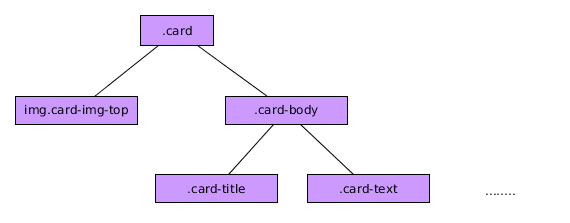

# Componente BootStrap 4 Card

El componente BootStrap 4 ***Card*** es uno de las novedades de este nueva versión y viene a sustituir a los viejos componentes *panels*, *wells* y *thumbnails*.


Es una construcción muy flexible ya que tiene como objetivo encapsular todo tipo de contenido. Sin embargo, en su estructura más básica y común podemos decir que su estructura sigue la siguiente jerarquía:




Siendo:

* El elemento con la clase ***card*** el elemento padre que contiene todo.
* La imagen con la clase ***img-card-top*** una imagen que se muestra en la zona superior del componente.
* El elemento con las clase ***card-body*** es el contenido del componente. Estará compuest a su vez con el título ***card-title*** (normalmente etiquetas hX) y el texto de la card ***card-text***.

No todos los elementos son obligatrios y podemos jugar a añadir y quitarlos para ver la apariencia final. Además podemos añadir otros elementos (según necesitemos) dentro de esta estructura.

Un ejemplo de aplicación de esta jerarquía sería:

```html

  <div class="card">
    
    <div class="card-body">
      <h3 class="card-title">Ejemplo de Card</h3>
      <div class="card-text">
        Texto descriptivo que queremos añadir al card
      </div>
    </div>
  </div>
```

## Más consideraciones sobre las *Cards*

* Podemos también añadir un subtítulo a la card con un elemento que tenga la clase ***class-subtitle*** justo detrás del título.
* Los enlaces tienes una clase especial con estilos propios ***card-link***.
* Puedo añadir cabeceras y pies a la *Card* posicionando los elementos en el lugar correcto y usando las clases ***card-header*** y ***card-footer***.
* Las *Cards* por defecto ocupan todo el ancho del elemento padre pero esto podemos variarlo usando clases BootStrap 4 para maqueta y/o utilidades BootStrap 4 (w-25,w-50, ...).
* Puedo situar la imagen al final de la *card* usando la clase ***img-card-bottom*** y moviendo la etiqueta al final.
* Puedo hacer que la imagen se use de fondo poniéndole la clase ***img-card*** y cambiando la clase del ***card-body*** por ***card-img-overlay***.


Adicionalmente puedo usar todas las utilidades de BootStrap 4 para colores, fondos etc..para mejorar la apariencia de las mismas.

**IMPORTANTE*** BootStrap 4 presenta tres layouts exclusivos para *Cards* y que nos permiten agrupar estos componentes: ***card-group***, ***card-deck*** y ***card-columns***. De momento estos no son responsivos y por eso se han dejado fuera de este curso. Pero os recomiendo que lo miréis, seguramente en el futuro se mejorarán.

Este componente no posee funciones asociadas ni dispara eventos.
