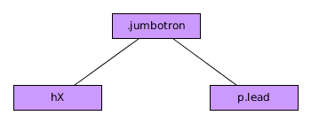

# Componente Jumbotron

El componente BootStrap ***Jumbotron*** es un componente sencillo que se utiliza para mostrar mensajes y/o títulos.


En su forma más común el DOM sigue la siguiente estructura:



Un ejemplo sencillo del uso de Jumbotron sería el siguiente.:


```html

  <div class="jumbotron">
    <h1>Título de Jumbotron</h1>
    <p class="lead">
      Párrafo con una clase <i>lead</i> para mensajes secundarios.
    </p>
  </div>

```

Como podemos ver, este componente modifica las tipografías, añade un color de fondo y unos bordes redondeados.

Si, por el contrario, preferimos que ocupe todo y no tener bordes redondeados debemos añadir la clase ***jumbotron-fluid*** al div con la clase ***jumbtron*** y añadir como hijo de este elemento un elemento con las clase ***container*** o ***container-fluid***.

Por ejemplo:


```html

  <div class="jumbotron jumbotron-fluid">
    <div class="container">
      <h1>Otro Jumbotron</h1>
      <p class="lead">
        Sin border y ocupando todo.
      </p>
    </div>
  </div>

```

Por supuesto podemos añadir más elementos dentro, lo que necesitemos y se nos ocurra.

Este componente no posee funciones asociadas ni dispara eventos.
